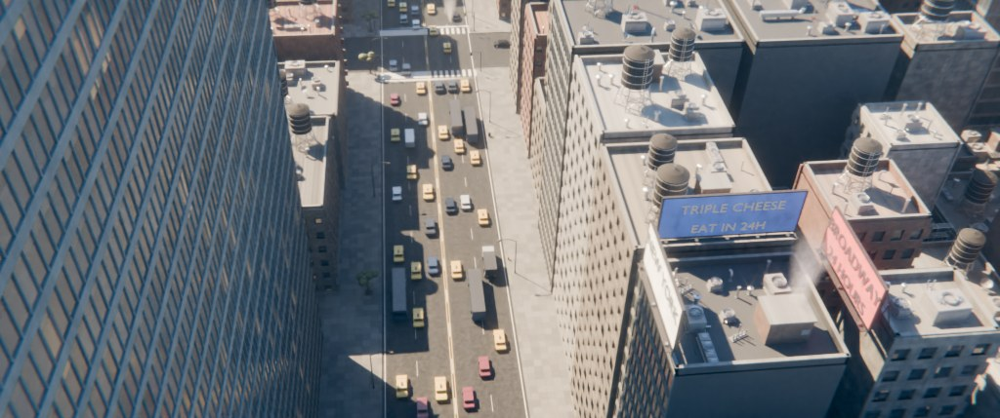
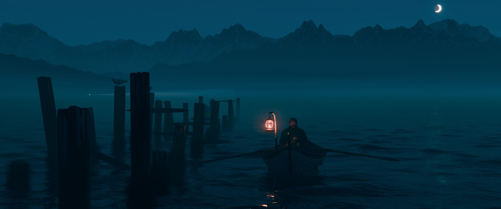

# Procedural Blender shots (Blender 5.x + Cycles)

Two finished cinematic shots. Each one is built from nothing by a single Python script: no asset
library, no downloaded textures, no photoscans, no add-ons. Every building, water tank, taxi,
brick and billboard in these files was generated by the code next to them. Open a `.blend` and
press Render, or change a number at the top of its builder and run it again.

| Shot | What it is |
|---|---|
| [Cinematic City](#cinematic-city--downtown-aerial) | A helicopter hanging over a Manhattan avenue on a bright afternoon |
| [5 AM Pre-dawn](#5-am-pre-dawn--cinematic-seascape) | An abandoned pier and a fisherman rowing out into sea fog |

---

## Cinematic City — downtown aerial

A dense downtown seen from a helicopter, looking down the length of an avenue in the middle of
the afternoon. A curtain-wall tower fills the left of frame; opposite it the sun rakes across
brick and cast-stone facades, water tanks and air handlers. The canyon floor stays in shadow
except for one bright strip along the east kerb, and the avenue below is nose to tail with
traffic that queues at the signal and pulls away again.

| | |
|---|---|
| Duration | 12 s: 288 frames at **24 fps** |
| Resolution | **2048 × 858**: DCI 2K, 2.39:1 scope (change `res_x` / `res_y` for 16:9) |
| Engine | Cycles, AgX view transform, OpenImageDenoise |
| Camera | 32 mm, 131 m above the street, pitched 41° down; a 17 m forward glide with an 8.5 m descent, a handheld float and a slight roll |
| Scene | about 540 buildings, 5,000 objects and 1.5 M faces, all generated at build time |

*Frame 1: a half-size CPU preview, rendered in a cloud sandbox only to check the look. The real
render is yours to do on the PC.*

### Rendering it on your PC

1. Open `Cinematic_City.blend` in Blender 5.x.
2. In **Edit → Preferences → System → Cycles Render Devices**, pick **OptiX** (NVIDIA RTX),
   **CUDA** (older NVIDIA) or **HIP** (AMD), and tick your GPU. The scene is already set to
   render on the GPU.
3. Press **Render → Render Animation** (Ctrl+F12). Frames go to
   `renders/City_frames/City_0001.png` … `City_0288.png`.
   * The render is resumable. Frames that already exist are skipped, so you can stop and restart
     at any time, and a second PC can share the same folder.
4. Switch to the scene **`City_Edit`** (scene selector, top right) and press **Render Animation**
   again. That turns the frames into `renders/Cinematic_City_0001-0288.mp4`.

### Render time

Quality is set high: 384 adaptive samples, motion blur on a 180° shutter for the traffic, and the
city haze ray-marched at its finest step so the gaps between the towers throw real shafts of light.

The only speed I could measure was on the 4-core cloud CPU used for the preview: 1024 × 429 at 40
samples took 100 seconds. Scaling that to full resolution and the final sample count puts a frame
somewhere around an hour on that CPU. A recent NVIDIA RTX GPU is usually 20–60× faster than it in
Cycles, so expect roughly **1–3 minutes per frame**.

To make it cheaper:

* Set **Max Samples** to 192 — with denoising it is very hard to tell apart.
* Raise `volume_step_rate` to 2 or 3. The haze is a smooth gradient, so this costs almost nothing
  visually and is the single biggest saving.
* Turn `motion_blur` off if you do not mind the traffic strobing a little at 24 fps.
* For a quick look first, set `quality="PREVIEW"` in the script and rebuild: 50 % size, 48 samples.
* Drop `detail_radius` and `clutter_radius` to build real window geometry and rooftop kit over a
  smaller area.

### Files

| File | What it is |
|---|---|
| `Cinematic_City.blend` | The finished scene, ready to render. |
| `build_cinematic_city.py` | Builds the whole thing from scratch. All the controls are in the `P = dict(...)` block at the top. |

To rebuild after changing settings, open `build_cinematic_city.py` in Blender's Scripting
workspace and click **Run Script**, or run `blender --python build_cinematic_city.py`. It rebuilds
only the `Cinematic_City` scene, so the 5 AM and 3 AM scenes in the other files are left alone.
Everything it makes is prefixed `CC_`.

### What is in the shot, and why it looks the way it does

* **The grid.** One wide avenue running away from the camera, cross streets at intervals, and a
  parallel avenue either side. The land between them is cut into blocks, and each block is split
  recursively into lots, so no two buildings share a frontage width and the roofline never
  repeats. Lots are shrunk slightly to leave alleys and light wells between neighbours.
* **The buildings.** Four kinds — curtain-wall towers, pre-war brick, cast-stone slabs with
  setbacks, and low utilitarian infill — each generated as a real facade rather than a texture: a
  recessed wall with spandrel bands, piers, sills and glazing built as separate geometry, so every
  window is a genuine opening with depth that catches its own shadow. Tall buildings step back in
  two or three tiers, each with its own roof deck.
* **Massing for the light.** The sun is in the west, so the west side of the avenue is what casts
  the shade. Those blocks are deliberately kept low and the east blocks tall, and the east blocks
  step down away from the avenue — that is what puts the afternoon sun on the facades the camera
  is looking at instead of leaving the whole frame in one building's shadow.
* **The roofs.** The part of New York you only see from up here: cedar water tanks silvered by
  thirty years of weather, standing on splayed steel frames with hoops and a ladder; packed air
  handlers with louvred casings and fan cowls; condenser banks, duct runs on sleepers, vent
  stacks, goosebacks, stair bulkheads, skylights, pipe clusters, dishes, lattice masts with a red
  obstruction lamp, parapets with stone coping. A tower crane stands over one roof and
  scaffolding climbs one facade, as in the reference.
* **Fire escapes.** Real zig-zag ironwork on the masonry buildings facing the camera: grating
  platforms on brackets, alternating stair flights with individual treads, railings with balusters,
  and a counterweighted drop ladder.
* **The street.** Asphalt with aggregate, tar seams, patches, cracks and polished wheel tracks.
  The lane markings are not a texture map — the material reads the street layout out of the same
  parameters the geometry uses, so the double yellow, the dashed lane lines, the kerb line, the
  stop bars and the zebra crossings are all drawn in the right places automatically and would move
  with the streets if you moved them. Above that: flagstone sidewalks, lamp standards, traffic
  signals, hydrants, bins and plane trees in kerb pits.
* **The traffic.** Yellow cabs, sedans, an SUV, vans, box trucks and a bus, on six lanes of the
  avenue and four of a cross street. They are not on paths: a small car-following simulation runs
  the whole shot before a single keyframe is written, so each vehicle keeps a headway to the car
  in front, brakes for the red light, queues, and accelerates away when it goes green — and the
  cross street runs on the opposite phase. Brake lights come on when a car is actually slowing:
  the lamp material reads the object's own colour, so one material serves every instanced car and
  still lights up per vehicle.
* **Signage.** Painted, softly back-lit hoardings on walls and roofs with frames, back bracing, a
  maintenance walkway and floodlights, plus projecting neon blade signs. The lettering is real
  text, scaled to fit the panel it is painted on.
* **Light.** A physical sky with the sun 43° up in the north-west, so the shot is back-lit and the
  shadows rake across the avenue. The sun and sky are balanced by measurement rather than by eye —
  the sky model is physically bright, and a weak sun against it just gives flat blue overcast
  light, which is the single easiest way to make a daylight render look wrong.
* **Air.** An exponential haze column over the whole city, forward-scattering, so the gaps between
  the towers fill with light and the distance goes pale. Steam rolls off the roof vents and out of
  the street manholes, drifting and changing shape as it climbs.
* **Materials.** Everything is a procedural node graph, so it holds up at any resolution and there
  is nothing to unpack: running-bond brick with per-brick colour scatter and raked joints, cut
  stone with panel joints and soot, board-formed concrete with blow holes, curtain-wall glass with
  per-panel tint, blinds and grime, tar-and-gravel roofs with ponding, galvanised and painted metal
  that rusts from the edges and runs down, silvered cedar. Walls read their coordinates off the
  geometry so courses and window grids run round all four faces without a UV map, and props use
  object space so an instanced tank keeps its staves and a moving car's dust does not swim.
* **Culling.** The camera is built first, then every building is tested against the frustum at
  five points along the move. What the camera can see is built in full; what it cannot but which
  still casts a shadow into frame is built as a plain box; anything beyond that is skipped.

### The main controls in `P`

| Control | What it does |
|---|---|
| `seed` | a different city |
| `quality` | `"FINAL"` or `"PREVIEW"` (50 % size, 48 samples) |
| `exposure` | overall brightness |
| `sun_elevation` / `sun_azimuth` | the time of day and which way the shadows fall |
| `sun_strength` / `sky_strength` | the balance between direct sun and sky fill — the contrast of the whole shot |
| `west_scale`, `west_cap`, `east_scale`, `east_falloff`, `near_cap` | the massing that decides where the sun lands |
| `haze_density`, `haze_height` | how strongly the air catches the light |
| `steam`, `steam_plumes`, `steam_density` | the vapour off the roofs and out of the street |
| `n_vehicles`, `traffic_speed`, `signal_period`, `signal_green` | the traffic and the lights |
| `detail_radius`, `clutter_radius` | how far out real windows and full rooftop kit are built |
| `cam_start`, `cam_travel`, `cam_rise`, `cam_pitch`, `cam_yaw`, `lens` | the camera and its move |
| `water_tanks`, `rooftop_crane`, `scaffolding`, `fire_escapes`, `trees`, `signage`, `traffic` | switch elements on or off |
| `motion_blur`, `samples`, `volume_step_rate` | render cost |

---

## 5 AM Pre-dawn — cinematic seascape

A hyper-realistic pre-dawn shot at 5:00 AM. The sun is 8.5° below the horizon, so there is no sun in the sky:
the scene is lit by the dim, diffuse glow of the twilight sky, a few old pier lamps and one warm kerosene
lantern. The camera glides slowly along a rotting plank pier past an abandoned red fish house. Beside it, an
old fisherman rows his wooden boat out past the posts of the pier's ruined end, into sea fog rolling just
above the water. Behind him, eroded mountain ranges fade into the distance.

| | |
|---|---|
| Duration | 15 s: 900 frames at **60 fps** |
| Resolution | **2048 × 858**: DCI 2K, 2.39:1 scope (change `res_x` / `res_y` for 16:9) |
| Engine | Cycles, AgX view transform, OpenImageDenoise |
| Camera | 24 mm wide, 2.2 m above the water off the pier's seaward side: the whole fish house, deck, lamps, boat and mountains in frame, with a slow 3 m glide; focus follows the boat |

*Frame 1: a 32-sample CPU preview, rendered in a cloud sandbox only to check the look. The real render is
yours to do on the PC.*

Built and tested with Blender 5.0. The file opens in 5.2 LTS.

### Rendering it on your PC

1. Open `5AM_Predawn.blend` in Blender 5.x.
2. In **Edit → Preferences → System → Cycles Render Devices**, pick **OptiX** (NVIDIA RTX), **CUDA** (older
   NVIDIA) or **HIP** (AMD), and tick your GPU. The scene is already set to render on the GPU.
3. Press **Render → Render Animation** (Ctrl+F12). Frames go to `renders/5AM_frames/5AM_0001.png` …
   `5AM_0900.png`.
   * The render is resumable. Frames that already exist are skipped, so you can stop and restart at any
     time. You can also run a second PC on the same folder and they'll share the work.
4. Switch to the scene **`5AM_Edit`** (scene selector, top right) and press **Render Animation** again. In about a minute it
   turns the frames and the soundtrack into `renders/5AM_Predawn_0001-0900.mp4` (H.264, AAC audio).

Keep the `audio` folder next to the `.blend`: the edit scene takes its sound from there.

### Render time

Quality is set high:

* The sea fog is path-traced, so the pier lamps and the lantern throw real light into it.
* Volumes are ray-marched at the finest step (`volume_step_rate=1`).
* 256 adaptive samples with OpenImageDenoise, 3 volume bounces and 4 diffuse bounces.

The only speed I could measure was on the 4-core cloud CPU used for the preview: a full-resolution frame at
64 samples took about 12½ minutes. A recent NVIDIA RTX GPU is usually 20–60× faster than that in Cycles.
At these settings, expect roughly **2–5 minutes per frame**. That is a long render, but it is resumable.

To adjust it:

* For a faster render, set **Max Samples** to 128 and `volume_step_rate` to 2. It looks almost the same.
* Setting `fog_scatter=0` goes back to the cheap fog, with no light from the lamps inside it.
* For a quick look first, set `quality="PREVIEW"` in the script and rebuild. That renders at 50 % size with
  48 samples.
* `volume_step_rate` sets the ray-march step: 1 is the finest, 4 is a draft. The default of 2 is visually
  the same as 1.

### Files

| File | What it is |
|---|---|
| `5AM_Predawn.blend` | The finished scene, ready to render. The heightmaps are packed inside it. |
| `build_5am_predawn.py` | Builds the whole scene from scratch. All the controls are in the `P = dict(...)` block at the top. |
| `textures/5AM_terrain_*.png` | 16-bit heightmaps of the three ranges, plus `5AM_terrain.json` (their extents and heights). |
| `tools/make_terrain.py` | Grows those heightmaps with an erosion simulation. Needs numpy, scipy, numba and pillow; not Blender. |
| `assets/5AM_rower.blend` | The fisherman: rigged, dressed and groomed. The builder appends him into the boat. |
| `tools/make_rower.py` | Builds that character from MakeHuman's CC0 data (`blender -b --python tools/make_rower.py -- <mpfb2>/src/mpfb/data`). |
| `make_soundtrack.py` | Builds the soundtrack stems from real field recordings. `--shot 5am` is the default; `--shot 3am` still makes the old harbour soundtrack. |
| `audio/` | The 5 AM stems (20 s each, so the 15 s shot has handles) and the source recordings. |
| `build_3am_harbor.py` | The original 3 AM harbour builder. The 5 AM builder reuses its pier and fish house, so keep it next to the script. |

To rebuild after changing settings, open `build_5am_predawn.py` in Blender's Scripting workspace and click **Run
Script**, or run `blender --python build_5am_predawn.py`. It rebuilds only the `5AM_Predawn` scene, so the rest
of the file is left alone.

### What is in the shot, and why it looks the way it does

* **Light.** A physically based *multiple-scattering* sky (Blender 5's twilight model) with the sun 8.5° below
  the horizon, ahead and to the right, so the sky on that side is slightly brighter. A thin waning crescent
  moon hangs low in the east, as it does before sunrise; its lit edge faces the hidden sun. Set
  `moon=False` to remove it.
* **Mountains.** Three ranges, each grown by a stream-power erosion simulation, so they have real branching
  drainage, sharp ridges and spurs that run down into the sea:
  * a dark coastal headland 3–8 km away on the left;
  * a fjord range 9–18 km away;
  * a snow-capped massif 17–44 km away.
  The material adds forest below the treeline, alpine meadow, rock, scree, snowfields and dark wet rock at
  the tideline.
* **Aerial perspective.** Each farther range fades toward the colour of the horizon sky behind it. That
  colour is read from the sky model itself, so the haze always matches the sky.
* **Ocean.** A real FFT ocean made from two Ocean modifiers:
  * a long, smooth swell (about 0.6 m);
  * a light wind sea (about 0.25 m) with Jacobian whitecap foam.

  Shader ripples come and go in breeze patches with glassy slicks between them. The waves ease out with
  distance so the horizon never shimmers.
* **The rower.** A detailed human built from MakeHuman's CC0 base mesh and shaped into a weathered man in
  his fifties. He has MakeHuman's full 163-bone skeleton and skin weights, real eyes, a grey-flecked beard,
  eyebrows, and skin with subsurface scattering and pores. He wears a dark oilskin jacket with a stand-up
  collar, canvas trousers, rubber sea boots and a knitted wool cap.
* **The rowing.** There is no motor. He sculls with two oars through a full, realistic stroke cycle every
  2.7 s:
  * the catch;
  * the drive, with the blades buried and square;
  * the finish, where the blades lift out and feather flat;
  * the recovery, hands away first and then the body swings forward.

  His hands are held to the oar grips by IK, his feet are braced on the stretcher, and he takes one look
  over his shoulder to check his course. The boat surges on every stroke and floats on the actual FFT
  waves: probes shrinkwrapped to the sea surface drive its heave, pitch and roll. Each catch leaves a ring
  of ripples and each finish leaves a glassy puddle in the water behind him.
* **The boat.** A clinker-built Norwegian-style double-ender with lapped planks, keel and curled stems,
  ribs, gunwales, thwarts and bronze rowlocks. The old paint is peeling to grey wood, with rust weeping
  from the rivets and green weed at the waterline. Aboard are a fish box, a net, a coil of rope, a tin
  bucket, and a hurricane lantern swinging on its crook, with a soft halo in the damp air.
* **The pier and the fish house.** These are built by your 3 AM builder's own code, which the 5 AM
  builder runs and renames `H5H_`, so `build_3am_harbor.py` must stay next to the script. The pier is
  rotting planks with moss and little plants in the cracks, missing and sagging boards, and a collapsed
  end. The house is red clapboard with peeling paint, broken windows, a hanging door, a barrel chimney,
  and a mast with wires. Crates, a barrel, rope and a buoy sit on the deck. Three old pier lamps line the
  walk, as in your third photo: one flickers, one is dead, and a cable sags between them.
* **The jetty.** Beyond the pier's collapsed end, two rows of rotten posts run out into the fog, modelled on your reference photo: grey
  cracked wood with rust-orange rot on top, moss, then a skirt of bright green weed strands at the tide
  line, barnacle crust and black slime below. Broken stringers, a sagging rope to a bobbing mooring buoy,
  and kelp and driftwood riding the swell complete it.
* **Life.** Gulls perch on the posts and fly slowly across the sky, flapping between glides. A lighthouse on
  the headland turns its beam through the haze, and the lamp flares each time the beam passes the camera.
* **Fog.** A dense layer 1–5 m deep lies on the water. Its top heaves in slow swells and rolling billows, it
  drifts with the breeze and keeps changing shape. Farther out, a fog bank hides the foot of the mountains.

The main controls in `P`:

| Control | What it does |
|---|---|
| `exposure` | overall brightness |
| `sun_elevation` / `sun_azimuth` | how light the sky is and which side glows |
| `fog_density`, `fog_top`, `fog_billow` | how thick the fog is and how it rolls |
| `haze_density` | how quickly the mountains fade |
| `wind_speed`, `swell_scale`, `windsea_scale` | how rough the sea is |
| `cam_travel` / `cam_yaw` | the camera move |
| `boat_start`, `boat_heading`, `boat_speed`, `stroke_period` | where he rows and how fast |
| `lantern_power` | the lantern's brightness |
| `pier`, `jetty`, `gulls`, `lighthouse`, `kelp`, `moon` | switch elements on or off |
| `pier_offset`, `pier_rotation`, `pier_lamp_power` | where the pier and house stand, and how bright their lamps are |

### Credits

* Waves: Luftrum, "oceanwavescrushing.wav", freesound #48412, **CC BY 4.0. Credit required.**
* Wind: felix.blume, freesound #217506, CC0.
* Both as edited for the Blanket app (github.com/rafaelmardojai/blanket).
* Human base mesh, body targets, skeleton and skin weights: MakeHuman / MPFB2
  (github.com/makehumancommunity/mpfb2), CC0.
